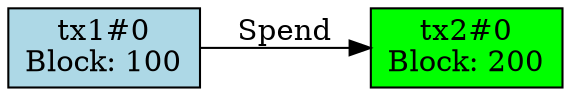

# Cardano State Machine Visualizer

A terminal-based tool for visualizing and analyzing Cardano smart contract state machines. Track UTXO states,
transitions, and datum evolution through an interactive TUI or export to various formats.

## Features

- 📊 **State Graph Building** - Automatically construct state transition graphs from on-chain transactions
- 🖥️ **Interactive TUI** - Navigate states, inspect datums, and view transactions in a rich terminal interface
- 📈 **Multiple Output Formats** - JSON, tables, Graphviz DOT, or interactive TUI
- 🔍 **Datum Inspector** - View raw CBOR hex or decoded PlutusData structures
- 📝 **Schema Support** - Define custom schemas for human-readable field names and classifications
- 🎨 **Color-Coded States** - Visual distinction between states types

## Installation

### Prerequisites

- Rust: install from [rustup.rs](https://rustup.rs)
- Graphviz: optional, for DOT format visualization

### Build from Source

```bash
git clone <repository-url>
cd cardano-state-viz
cargo build --release
```

The binary will be available at `target/release/cardano-state-viz`.

## Quick Start

### Analyze a Contract with Mock Data

```bash
# View in interactive TUI
cargo run -- analyze --address mock --output tui

# Export to DOT format for Graphviz
cargo run -- analyze --address mock --output dot

# Output as JSON
cargo run -- analyze --address mock --output json

# Output as table
cargo run -- analyze --address mock --output table
```

## CLI Usage

### Command Structure

```bash
cardano-state-viz <COMMAND> [OPTIONS]
```

### Commands

#### `analyze` - Analyze a Smart Contract

Analyze transactions at a script address and visualize the state machine.

```bash
cardano-state-viz analyze [OPTIONS] --address <ADDRESS>
```

**Options:**

- `--address <ADDRESS>` - Script address to analyze (required)
    - Use `mock` for demo data
    - Or provide a Cardano address (e.g., `addr_test1...`)

- `--source <SOURCE>` - Data source (default: `mock`)
    - `mock` - Use built-in mock vesting contract data
    - `blockfrost` - Query Blockfrost API (requires API key in config)
    - `node` - Query local Cardano node (not yet implemented)

- `--output <FORMAT>` - Output format (default: `table`)
    - `json` - JSON output with full transaction and datum data
    - `table` - Formatted table view
    - `dot` - Graphviz DOT format for graph visualization
    - `tui` - Interactive terminal UI (recommended)

- `--schema <PATH>` - Path to contract schema file (optional)
    - Example: `--schema schemas/vesting.toml`

**Examples:**

```bash
# Interactive TUI with mock data
cargo run -- analyze --address mock --output tui

# Export state graph to PNG via Graphviz
cargo run -- analyze --address mock --output dot

# Analyze with custom schema
cargo run -- analyze --address mock --schema schemas/vesting.toml --output tui

# JSON output for programmatic processing
cargo run -- analyze --address mock --output json | jq '.transactions | length'
```

#### `schema-validate` - Validate a Contract Schema

Validate the structure and syntax of a contract schema file.

```bash
cardano-state-viz schema-validate <SCHEMA_PATH>
```

**Example:**

```bash
cargo run -- schema-validate schemas/vesting.toml
```

**Output:**

```
📋 Schema Validation Report
━━━━━━━━━━━━━━━━━━━━━━━━━━━━━━━━━━━━━━━━━━━
File: "schemas/vesting.toml"

Contract:
  Name: Simple Token Vesting
  Description: Lock tokens until a specific time...
  Script Address: addr_test1...

Datum:
  Type: constr
  Fields: 3
    - beneficiary (bytes)
    - unlock_time (int)
    - amount (int)

Redeemers: 2
    - Unlock (index 0)
    - Cancel (index 1)

✅ Schema is valid!
```

## TUI (Terminal User Interface)

Launch the interactive TUI for the best visualization experience:

```bash
cargo run -- analyze --address mock --output tui
```

### TUI Views

The TUI has five different views you can switch between:

1. **Graph Overview** - List of all states sorted by block/slot
2. **State Detail** - Detailed view of selected state with transitions
3. **Transaction List** - All transactions affecting the contract
4. **Datum Inspector** - Hex and decoded views of datum data
5. **Help** - Keyboard shortcuts and legend

### Keyboard Shortcuts

#### Navigation

- `↑/↓` - Navigate through items (context-aware)
- `Enter` - Open detail view
- `Esc` - Return to graph overview

#### View Switching

- `g` - Graph overview (state list)
- `d` - State detail view
- `t` - Transaction list view
- `i` - Datum inspector view
- `h` or `?` - Help screen
- `Tab` - Cycle through views

#### Datum Inspector

- `x` - Toggle between hex and decoded view

#### General

- `q` - Quit application

### State Color Legend

States are color-coded based on their position in the graph:

- 🔵 **Light Blue (Initial)** - No incoming transitions (newly created)
- 🟡 **Yellow (Active)** - Has both incoming and outgoing transitions
- 🟢 **Green (Completed)** - No outgoing transitions (terminal state)
- 🔴 **Red (Failed)** - Error state
- 🟣 **Magenta (Locked)** - Temporarily locked state
- ⚪ **Gray (Unknown)** - State classification unknown

### TUI Screenshots (Conceptual)

**Graph Overview:**

```
┌─ Cardano State Machine Visualizer - Graph Overview ─┐
│                                                       │
├─ States ─────────────────────────────────────────────┤
│  ► tx1#0 | Block: 100 | Slot: 1000 | 10.0 ADA       │
│    tx3#0 | Block: 150 | Slot: 1500 | 5.0 ADA        │
│    tx2#0 | Block: 200 | Slot: 2000 | 9.0 ADA        │
│                                                       │
├───────────────────────────────────────────────────────┤
│ States: 3 | Transitions: 1 | [↑/↓] Navigate ...     │
└───────────────────────────────────────────────────────┘
```

**State Detail:**

```
┌─ State Detail View ───────────────────────────────────┐
│                                                       │
├─ State Information ───────────────────────────────────┤
│ ID: tx1#0                                            │
│ Classification: Initial                              │
│ Block: 100                                           │
│ Slot: 1000                                           │
│ ADA Value: 10.0 ADA                                  │
│                                                       │
├─ Incoming Transitions ────────────────────────────────┤
│ No incoming transitions (Initial state)              │
│                                                       │
├─ Outgoing Transitions ────────────────────────────────┤
│ → tx2#0 (tx: tx2)                                    │
│                                                       │
├───────────────────────────────────────────────────────┤
│ [↑/↓] Navigate | [g] Back | [h] Help | [q] Quit     │
└───────────────────────────────────────────────────────┘
```

## Configuration

Configuration file location: `~/.config/cardano-state-viz/config.toml`

### Example Configuration

```toml
[blockfrost]
api_key = "your_api_key_here"
max_retries = 3
retry_delay_ms = 1000

[logging]
level = "info"  # trace, debug, info, warn, error
```

### Environment Variables

- `CARDANO_STATE_VIZ_LOG` - Set log level (overrides config)
- `BLOCKFROST_API_KEY` - Blockfrost API key (overrides config)

## Output Formats

### JSON

Full transaction and datum data in JSON format:

```json
{
  "transactions": [
    {
      "hash": "tx1",
      "block": 100,
      "slot": 1000,
      "inputs": [],
      "outputs": [
        {
          "address": "addr_test1...",
          "amount": [
            {
              "unit": "lovelace",
              "quantity": "10000000"
            }
          ],
          "datum": {
            "hash": "datum1",
            "raw_cbor": [
              1,
              2,
              3
            ],
            "parsed": {
              ...
            }
          }
        }
      ]
    }
  ]
}
```

### Table

Human-readable table format:

```
Transaction: tx1
Block: 100 | Slot: 1000
Inputs: 0
Outputs: 1
  [0] addr_test1... | 10.0 ADA
      Datum: datum1
```

### DOT (Graphviz)

Graph visualization format for Graphviz:



**Generate PNG:**

```bash
cargo run -- analyze --address mock --output dot
```

## Contract Schemas

Schemas provide human-readable field names and custom state classifications.

### Creating a Schema

Create a TOML file defining your contract structure:

```toml
[contract]
name = "My Contract"
description = "Contract description"
script_address = "addr_test1..."

[datum]
type = "constr"
fields = [
  { name = "beneficiary", type = "bytes", desc = "Recipient pubkey hash" },
  { name = "unlock_time", type = "int", desc = "POSIX timestamp" },
  { name = "amount", type = "int", desc = "Lovelace amount" },
]

[[redeemer]]
name = "Unlock"
constructor_index = 0

[[redeemer]]
name = "Cancel"
constructor_index = 1
```

### Using Schemas

```bash
# Validate schema
cargo run -- schema-validate schemas/my_contract.toml

# Use schema in analysis
cargo run -- analyze --address addr_test1... --schema schemas/my_contract.toml --output tui
```

See `docs/SCHEMA_FORMAT.md` for complete schema documentation.

### Example 1: Quick Visualization

```bash
# Launch TUI with mock vesting contract
cargo run -- analyze --address mock --output tui

# Press 'g' for graph overview
# Press 'd' to view state details
# Press 't' to see transaction list
# Press 'i' to inspect datums
# Press 'q' to quit
```

### Example 2: Export Graph

```bash
# Generate state graph visualization
cargo run -- analyze --address mock --output dot
```

### Example 3: Schema Workflow

```bash
# Create and validate schema
cargo run -- schema-validate schemas/vesting.toml

# Use schema for analysis
cargo run -- analyze --address mock \
  --schema schemas/vesting.toml \
  --output tui
```

### Example 4: Programmatic Analysis

```bash
# Extract transaction count
cargo run -- analyze --address mock --output json | jq '.transactions | length'

# Get all datum hashes
cargo run -- analyze --address mock --output json | jq '.transactions[].outputs[].datum.hash'

# Find states in block range
cargo run -- analyze --address mock --output json | jq '.transactions[] | select(.block >= 100 and .block <= 200)'
```

## Resources

- [Cardano Documentation](https://docs.cardano.org/)
- [Plutus Documentation](https://plutus.readthedocs.io/)
- [PlutusData Specification](https://github.com/input-output-hk/plutus)
- [Blockfrost API](https://blockfrost.io/)

---

**Built with Rust** 🦀 | **Powered by Ratatui** 🐭
